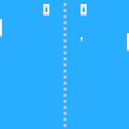

# Pong

A tiny game of pong made for the [PICO-8](https://www.lexaloffle.com/pico-8.php) fantasy console.

# Screenshots

# Installation

Load `pong.p8` file using your copy of the PICO-8 or you can download an already precompiled [pong.png]()cartridge file

# Note

You can also play this game in your [browser](https://www.lexaloffle.com/bbs/?pid=22670#p).

# License

Pong is under [MIT license](./LICENSE)
